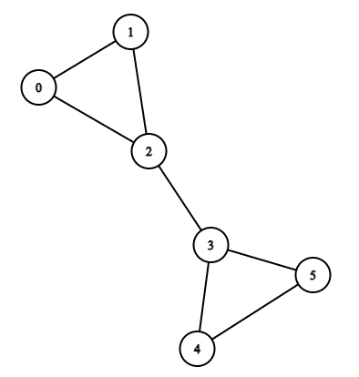
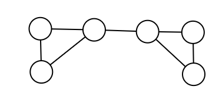

# CSE 280 Group 06

(c) BYU-Idaho - It is an honor code violation to post this
file completed or uncompleted in a public file sharing site.

**Instructions**: Work on all questions as a group as instructed during class.  We will review each answer during class.

## Question 1

Consider the graph below.  Find the following: total edges, total vertices, total degree of each vertex.

## Question 2

Does the graph from Question 1 have an Euler circuit?  How do you know?

## Question 3

The following graph does not have an Euler circuit.  How can you add 1 new edge to ensure there is a Euler circuit?

## Question 4

Consider the following two graphs.  If these graphs are isomorphic, then fill in the missing letters A through F.

|Graph 1|Graph 2
|:-:|:-:|
|||

## Question 5

Consider the Finite State Machine (FSM) below.

**Part 1**

* What is the final state with input 100011?  Is the input accepted?
* What is the final state with input 0000? Is the input accepted?
* What is the final state with input 1100? Is the input accepted?

**Part 2**

What type of input stream does the FSM look for?
