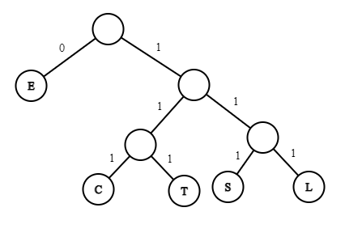

# CSE 280 Group 07

(c) BYU-Idaho - It is an honor code violation to post this
file completed or uncompleted in a public file sharing site.

**Instructions**: Work on all questions as a group as instructed during class.  We will review each answer during class.

## Question 1

Consider the encoding tree below.  How would encode `CSEE`?  How many bits did you save with the encoding assuming letters take 8 bits?

## Question 2

In the rooted tree below (vertex 0 is the root), determine the following:

* Forward Inorder Traversal
* Backward Inorder Traversal
* Pre-order Traversal
* Post-order Traversal

## Question 3

In the graph below, determine a spanning tree by using Depth First Search and then again by using Breadth First Search.  If you have colored pens or pencils, then highlight the route on the diagram below. 

