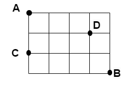

# CSE 280 Group 13

(c) BYU-Idaho - It is an honor code violation to post this
file completed or uncompleted in a public file sharing site.

**Instructions**: Work on all questions as a group as instructed during class.  We will review each answer during class.

## Question 1

A multiple choice test consists of five questions, each of which has four choices.  Each question has exactly one correct answer.  

* How many different ways are there to fill out the answer sheet?
* How many ways are there to fill out the answer sheet so that four answers are correct and one is incorrect?
* William guesses randomly at each answer.  What is the probability that he gets three or fewer questions correct?

## Question 2

In a collection of 20 samples, there are 5 which are bad.  If you select 4 at random, what is the probability that none of the samples selected are bad?

## Question 3

Consider the following road grid in which you can only go right and down.  Given a randomly selected route between points A and B, what is the proability:

* that you will go through point C?
* that you will go through point D?

## Question 4

Email data suggests that 80% of all email is spam.  Furthermore, 10% of all spam emails contain the word "alert".  By contrast, only 2% of non-spam emails contain the word "alert".  What is the probability that a randomly chosen email message is spam, given that it contains the word "alert"?  Use Bayes Theorem to solve.

## Question 5

In a group of 15 chefs, there are 8 french chefs and 7 italian chefs. A group of 6 chefs is selected for a competition.  

* What is the probaility that the group will have no italian chefs?
* What is the proablity that the group will have at least one italian chef?
* What is the probability that there will an equal number of french and italian chefs?