# CSE 280 Test 01

(c) BYU-Idaho - It is an honor code violation to post this
file completed or uncompleted in a public file sharing site.

**Instructions**: Select the correct answer (a, b, c, or d) for each question below.  It is highly recommended that you record your answers on a paper copy of the exam.  After solving each problem, record your answers in the I-Learn quiz.  After you submit the quiz in I-Learn, you will be shown the problems that you got wrong.  Reconsider the problems you got wrong and then resubmit your test a second time.  When you resumit your test a second time with the I-Learn quiz, you will need to record the answers to all problems.  Your final score will be the maximum of the two submittals.

## Question 1

Let $p$ = True, $q$ = True, and $r$ = False.  Select the expression that evaluates to False.

|Choice|Answer|
|:-:|:-:|
|(a)|$\neg r$|
|(b)|$p \lor q$|
|(c)|$p \lor r$|
|(d)|$q \land r$|

## Question 2

The domain for variable $x$ is the set of all integers.  Select the statement that is False.

|Choice|Answer|
|:-:|:-:|
|(a)|$\forall x (x^2 \ge x)$|
|(b)|$\forall x (x^2 \ne 5)$|
|(c)|$\exists x (x = x)$|
|(d)|$\forall x (x^2 \gt x)$|

## Question 3

Select the value of $\lceil -5.8 \rceil$.

|Choice|Answer|
|:-:|:-:|
|(a)|$6$|
|(b)|$-5$|
|(c)|$5$|
|(d)|$-6$|

## Question 4

Select the relation that is an equivalence relation.  The domain is the set $\lbrace 1, 2, 3, 4 \rbrace$.

|Choice|Answer|
|:-:|:-:|
|(a)|$\lbrace (1,4),(4,1),(1,3),(3,1),(1,1),(2,2),(3,3),(4,4) \rbrace$|
|(b)|$\lbrace (1,4),(4,1),(1,3),(3,1),(2,2) \rbrace$|
|(c)|$\lbrace (1,4),(4,1),(2,2),(3,3) \rbrace$|
|(d)|$\lbrace (1,4),(4,1),(1,1),(2,2),(3,3),(4,4) \rbrace$|

## Question 5

Select the set that is equal to $\lbrace 3, 5, 7, 9, 11, 13 \rbrace$.

|Choice|Answer|
|:-:|:-:|
|(a)|$\lbrace x \in \mathbf{Z} \mid 3 \lt x \lt 14 \rbrace$|
|(b)|$\lbrace x \in \mathbf{Z} \mid x \text{ is odd and } 3 \le x \le 14 \rbrace$|
|(c)|$\lbrace x \in \mathbf{Z} \mid x \text{ is prime and } 3 \le x \lt 14 \rbrace$|
|(d)|$\lbrace x \in \mathbf{R} \mid 3 \le x \lt 14 \rbrace$|

## Question 6

Which statement is the contrapositive of:

"If $x=4$, then $3x=12$".

|Choice|Answer|
|:-:|:-:|
|(a)|If $x \ne 12$, then $3x \ne 12$.|
|(b)|If $3x=12$, then $x=4$.|
|(c)|If $x=4$, then $3x=12$.|
|(d)|If $3x \ne 12$, then $x \ne 4$.|

## Question 7

Use De Morgan's law to selet the statement that is logically equivalent to: 

"It is not true that ever student got an A on the test."

|Choice|Answer|
|:-:|:-:|
|(a)|There is a student who got an A on the test.|
|(b)|Every student got an A on the test.|
|(c)|Every student did not get an A on the test.|
|(d)|There is a student who did not get an A on the test.|

## Question 8

Select the expression that is equal to the set corresponding to the shaded region in the Venn diagram below:

|Choice|Answer|
|:-:|:-:|
|(a)|$(A \cup B) \cup C$|
|(b)|$(A \cap B) \cup C$|
|(c)|$(A \cup B) \cap C$|
|(d)|$(A \cap B) \cap C$|

## Question 9

Let $f: \mathbf{Z} \to \mathbf{Z} \text{ and } f(x) = 2x-5$.  Selet the corret statement about the inverse of $f$.

|Choice|Answer|
|:-:|:-:|
|(a)|$f^{-1} = (x-5)/2$|
|(b)|$f$ does not have a well-defined inverse.|
|(c)|$f^{-1} = 2(x-5)$|
|(d)|$f^{-1} = (x+5)/2$|

## Question 10

The domain of a relation $R$ is the set of all real numbers.  Let $x$ be related to $y$ under the relation $R$ if $\vert x+y \vert \le 2$.  Select the description that accurately describes relation $R$.

|Choice|Answer|
|:-:|:-:|
|(a)|Anti-reflexive|
|(b)|Reflexive|
|(c)|Transitive|
|(d)|Neither reflexive nor anti-reflexive|

## Question 11

Which logical equivalence is an example of the Distributive law?

|Choice|Answer|
|:-:|:-:|
|(a)|$(p \lor \neg q) \land (p \lor \neg r) \equiv (\neg \neg p \lor \neg q) \land (p \lor \neg r)$|
|(b)|$(p \lor \neg q) \land (p \lor \neg r) \equiv (p \lor (\neg q \land \neg r)) $|
|(c)|$(p \lor \neg q) \land (p \lor \neg r) \equiv (p \lor \neg r)\land (p \lor \neg q)$|
|(d)|$(p \land \neg q) \lor (p \lor \neg r) \equiv ((p \land \neg q) \lor p) \lor \neg r$|

## Question 12

Let $f: \lbrace 0, 1,2,3,4 \rbrace \to \lbrace 0,1,2,3,4 \rbrace \text{ and } f(x) = 4-x$.  Selet the corret statement about the inverse of $f$.

|Choice|Answer|
|:-:|:-:|
|(a)|$f^{-1}(x) = x / 4$|
|(b)|$f^{-1}(x) = 4 + x$|
|(c)|$f$ does not have a well-defined inverse|
|(d)|$f^{-1}(x) = 4-x$|

## Question 13

Select the converse of $p \to q$.

|Choice|Answer|
|:-:|:-:|
|(a)|$\neg q \to \neg p$|
|(b)|$p \to q$|
|(c)|$\neg p \to \neg q$|
|(d)|$q \to p$|

## Question 14

Select the statement that is not a proposition.

|Choice|Answer|
|:-:|:-:|
|(a)|It will be sunny tomorrow.|
|(b)|$5 + 4 = 88$|
|(c)|Chocolate is the best flavor.|
|(d)|Take out the trash.|

## Question 15

Use De Morgan's law to select the statement that is equivalent to:

"It is not true that the patient has high blood pressure or influenza."

|Choice|Answer|
|:-:|:-:|
|(a)|The patient has high blood pressure or has influenza.|
|(b)|The patient does not have high blood pressure and does not have influenza.|
|(c)|The patient does not have high blood pressure or does not have influenza.|
|(d)|The patient has high blood pressure and has influenza.|

## Question 16

Let $A = \lbrace a, b \rbrace$ and $B = \lbrace 1, 2, 3 \rbrace$.  Select the expression that is an element of $A \times B \times B$.

|Choice|Answer|
|:-:|:-:|
|(a)|$(2,1,1)$|
|(b)|$(a,a,1)$|
|(c)|$(b,2,3)$|
|(d)|$(b,22)$|

## Question 17

Let $A = \lbrace x \in \mathbf{Z} \mid x \text{ is a prime number} \rbrace$ and $B = \lbrace 4, 7, 9, 11, 13, 14 \rbrace$.  Select the set orresponding to $A \cap B$.

|Choice|Answer|
|:-:|:-:|
|(a)|$\lbrace 4, 7, 9, 11, 13, 14 \rbrace$|
|(b)|$\lbrace 7, 9, 11,13,14 \rbrace$|
|(c)|$\empty$|
|(d)|$\lbrace 7, 11, 13 \rbrace$|

## Question 18

Let $p =$ True, $q =$ False, and $r =$ False.  Select the expression that evaluates to True.

|Choice|Answer|
|:-:|:-:|
|(a)|$(q \lor r) \land p$|
|(b)|$\neg(q \lor r \lor \neg p$|
|(c)|$(p \lor r) \land (q \lor \neg p$|
|(d)|$r \lor q \lor \neg p$|

## Question 19

The domain of a relation $R$ is the set of all real numbers.  Let $x$ be related to $y$ under relation $R$ if $\lceil x \rceil \le \lceil y \rceil$.  Select the description that accurately describes relation $R$.

|Choice|Answer|
|:-:|:-:|
|(a)|Anti-symmetric|
|(b)|Anti-reflexive|
|(c)|Neither symmetric nor anti-symmetric|
|(d)|Symmetric|

## Question 20

Select the inverse of the following statement:

"If it rained this morning, then the train will be late."

|Choice|Answer|
|:-:|:-:|
|(a)|If the train is late, then it rained this morning.|
|(b)|If the train is not late, then it didn't rain this morning.|
|(c)|If it didn't rain this morning, then the train will not be late.|
|(d)|THe train is not late despite the fact that it rained this morning.|

## Question 21

Let $A = \lbrace x \in \mathbf{Z} \mid x \text{ is odd} \rbrace$ and $B = \lbrace 2,5,9,11,14,16 \rbrace$.  Select the expression that is equal to $B - A$.

|Choice|Answer|
|:-:|:-:|
|(a)|$\lbrace 2, 5, 9, 11, 14, 16 \rbrace$|
|(b)|$\empty$|
|(c)|$\lbrace 5, 9, 11 \rbrace$|
|(d)|$\lbrace 2,14,16 \rbrace$|

## Question 22

Select the expression that is equal to the set corresponding to the shaded region in the Venn diagram below:

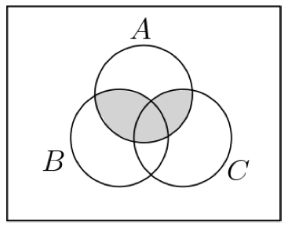

|Choice|Answer|
|:-:|:-:|
|(a)|$(C \cap B) \cup A$|
|(b)|$(C \cup B) \cap A$|
|(c)|$(C \cap B) \cap A$|
|(d)|$(C \cup B) \cup A$|

## Question 23

The domain for variable $x$ is the set of students in a class.  Define the predicates:

$S(x): x$ studied for the test.

$A(x): x$ received an A on the test.

Select the logical expression that is equivalent to:

"Everyone who studied for the test received an A on the test."

|Choice|Answer|
|:-:|:-:|
|(a)|$\forall x (A(x) \to S(x)$|
|(b)|$\forall x (S(x) \leftrightarrow A(x)$|
|(c)|$\forall x (S(x) \to A(x)$|
|(d)|$\forall x (S(x) \land A(x)$|

## Question 24

The propositional variables $f$, $h$, and $p$ represent the follow propositions:

$f$: The student got an A on the final.

$h$: The student turned in all the homework.

$p$: The student is on academic probation.

Select the logical expression that represents the statement:

"The student is not on academic probation and the student either got an A on the final or turned in all the homework."

|Choice|Answer|
|:-:|:-:|
|(a)|$(\neg p \land f) \lor h$|
|(b)|$\neg p \land (f \lor h)$|
|(c)|$\neg p \land f \land h$|
|(d)|$\neg(p \land f) \lor h$|

## Question 25

Select the set that corresponds to the relation given in the arrow diagram below:

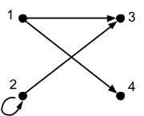

|Choice|Answer|
|:-:|:-:|
|(a)|$\lbrace (1,3), (1,4), (2,3),(2,2) \rbrace$|
|(b)|$\lbrace (1,3),(1,4),(2,3) \rbrace$|
|(c)|$\lbrace (1,3), (1,4), (3,2), (2,2) \rbrace$|
|(d)|$\lbrace (1,3),(1,4),(3,2) \rbrace$|

## Question 26

Select the set that corresponds to the relation given in the arrow diagram below:

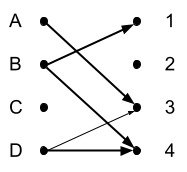

|Choice|Answer|
|:-:|:-:|
|(a)|$\lbrace (A,3),(B,1),(B,2),(D,3),(D,4) \rbrace$|
|(b)|$\lbrace (A,3),(B,1),(B,4),(D,3),(D,4) \rbrace$|
|(c)|$\lbrace (1,B),(2,B),(3,A),(3,D),(4,D) \rbrace$|
|(d)|$\lbrace (1,B),(3,A),(3,D),(4,B),(4,D) \rbrace$|

## Question 27

Select the logical expression that is equivalent to: $\neg \exists x (P(x) \land Q(x))$.

|Choice|Answer|
|:-:|:-:|
|(a)|$\forall x (\neg P(x) \land \neg Q(x))$|
|(b)|$\exists x (\neg P(x) \lor \neg Q(x))$|
|(c)|$\forall x (\neg P(x) \lor \neg Q(x))$|
|(d)|$\exists x (\neg P(x) \land \neg Q(x))$|

## Question 28

The domain of relation $R$ is the set of all integers.  Let $x$ be related to $y$ if $\vert x - y \vert \le 1$.  Which statement correctly characterizes the relation $R$.

|Choice|Answer|
|:-:|:-:|
|(a)|$R$ is not an equivalence relation because $R$ is not reflexive.|
|(b)|$R$ is an equivalence relation.|
|(c)|$R$ is not an equivalence relation beceuase $R$ is not symmetric.|
|(d)|$R$ is not an equivalence relation because $R$ is not transitive.|

## Question 29

Select the logic expression that is equivalent to: $\neg \forall x \exists y (P(x) \land Q(x,y))$.

|Choice|Answer|
|:-:|:-:|
|(a)|$\exists x \forall y (\neg P(x) \lor Q(x,y))$|
|(b)|$\forall y \exists x (\neg P(x) \lor \neg Q(x,y))$|
|(c)|$\exists x \forall y (\neg P(x) \lor \neg Q(x,y))$|
|(d)|$\forall x \exists y (\neg P(x) \lor \neg Q(x,y))$|

## Question 30

The domain for variable $x$ is the set of positive real numbers.  Select the statement that correctly describes the proposition $\forall x (x^2 \ge x)$.

|Choice|Answer|
|:-:|:-:|
|(a)|The proposition is false, and $x=1$ is a counterexample.|
|(b)|The proposition is true.|
|(c)|The proposition is false, and $x=1/2$ is a counterexample.|
|(d)|The proposition is false, and $x=-1$ is a counterexample.|

## Question 31

Select the set that is equal to $\lbrace 1, 2, 3, 4 \rbrace$.

|Choice|Answer|
|:-:|:-:|
|(a)|$\lbrace x \in \mathbf{R} \mid -3 \lt x \lt 5$|
|(b)|$\lbrace x \in \mathbf{R}^+ \mid -3 \lt x \lt 5$|
|(c)|$\lbrace x \in \mathbf{Z} \mid -3 \lt x \lt 5$|
|(d)|$\lbrace x \in \mathbf{Z}^+ \mid -3 \lt x \lt 5$|

## Question 32

Graph $G$ is defined by the arrow diagram below.  What is the out-degree of vertex 2?

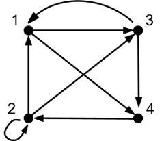

|Choice|Answer|
|:-:|:-:|
|(a)|3|
|(b)|1|
|(c)|2|
|(d)|4|

## Question 33

The figure below shows a partial design of an FSM.  The goal is for the FSM to accept a string if and only if x does not end with 000.  Which state(s) should be marked on the diagram as accepting states?

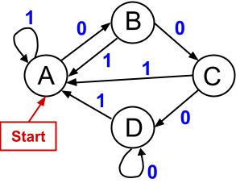

|Choice|Answer|
|:-:|:-:|
|(a)|A and B|
|(b)|A, B, and C|
|(c)|C|
|(d)|A, B, and D|

## Question 34

Select the order in which the vertices are visited in a post-order traversal of the tree shown below:

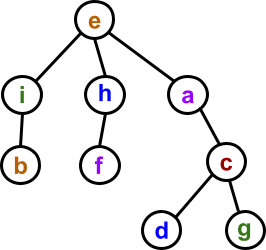

|Choice|Answer|
|:-:|:-:|
|(a)|b, i, f, h, d, g, c, a, e|
|(b)|e, i, b, h, f, a, d, c, g|
|(c)|b, i, f, h, a, d, g, c, e|
|(d)|e, i, b, h, f, a, c, d, g|

## Question 35

The degree sequence of a graph is a list of the degrees of all of the vertices in non-increasing order.  THe degree sequence for four different graphs are given below.  Each graph is guaranteed to be conneted.  Select the degree sequence corresponding to the graph that has an Euler circuit.

|Choice|Answer|
|:-:|:-:|
|(a)|5, 4, 4, 4, 3, 2, 2|
|(b)|6, 4, 4, 4, 3, 3, 2|
|(c)|4, 4, 4, 4, 2, 2, 2|
|(d)|5, 4, 4, 4, 3, 3, 2, 1|

## Question 36

Select the sentance that correctly describes the set of strings acepted by the FSM below:

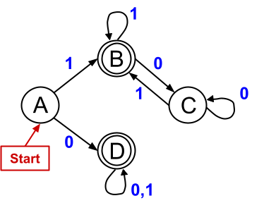

|Choice|Answer|
|:-:|:-:|
|(a)|The FSM accepts a string $x$ if and only if the numbers of 1's in $x$ is odd or the number of 0's in $x$ is odd.|
|(b)|The FSM acccepts a string $x$ if and only if $x$ contains at least one 0 and at least one 1.|
|(c)|The FSM accepts a string $x$ if and only if $x$ starts with a 0 or ends with a 1.|
|(d)|The FSM accepts a string $x$ if and only if $x$ is all 0's or all 1's.|

## Question 37

Select the order in which the vertices are visited in a pre-order traversal of the tree shown below.

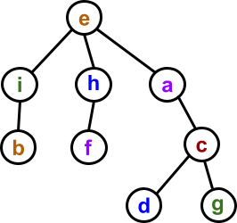

|Choice|Answer|
|:-:|:-:|
|(a)|e, i, b, h, f, a, d, c, g|
|(b)|e, i, b, h, f, a, c, d, g|
|(c)|b, i, f, h, d, g, c, a ,e|
|(d)|b, i, f, h, a, d, g, c, e|

## Question 38

Select the correct adjacency representation for the graph below:

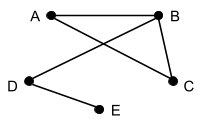

|Choice|Answer|
|:-:|:-:|
|(a)||
|(b)|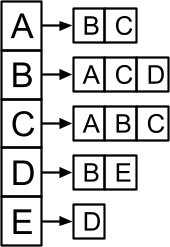|
|(c)||
|(d)|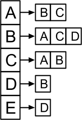|

## Question 39

What is the total degree of the graph below:

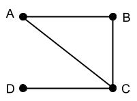

|Choice|Answer|
|:-:|:-:|
|(a)|3|
|(b)|8|
|(c)|4|
|(d)|6|

## Question 40

Use the prefix tree below to decode $10110011110$.

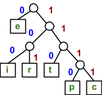

|Choice|Answer|
|:-:|:-:|
|(a)|ripe|
|(b)|rice|
|(c)|rite|
|(d)|tire|

